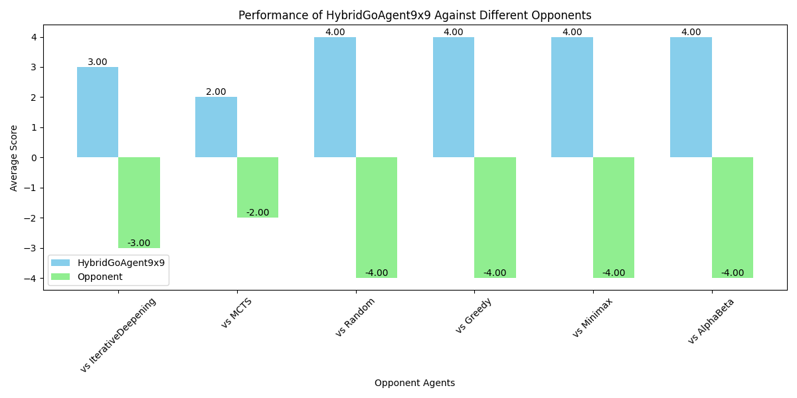

# AI Go Game Player

An advanced Go AI system featuring classical search algorithms, neural network-based agents, and hybrid strategies. Built with PyTorch and PySpiel for high-performance Go gameplay on 5×5 and 9×9 boards. Inspired by the breakthroughs of AlphaGo and AlphaZero, this project implements multiple AI approaches from traditional algorithms to deep reinforcement learning.


**Picture:** Professional Go player Lee Sedol contemplates his move against DeepMind's AlphaGo during their 2016 match in Seoul. This groundbreaking series marked a pivotal moment in AI history, demonstrating that machines could master one of humanity's most complex strategy games.

## Features

- **Classical Search Agents**: Random, Greedy, Minimax, Alpha-Beta, Iterative Deepening, MCTS
- **Learning-Based Agents**: Policy Network Agent, Value Network Agent, Neural MCTS Agent
- **Hybrid Agents**: Combine opening books + search algorithms for strong play
- **Training & Utilities**: Feature extraction, PyTorch models, save/load, datasets
- **Visualization & Evaluation**: Performance plots, rollout statistics, Pygame UI

## Classes & Architecture

### Core Game Abstractions

- **GameState** – Abstract base class for Go states. Tracks board positions and current player
- **AdversarialSearchProblem** – Defines the game's rules, transitions, terminal checks, and evaluation functions
- **HeuristicAdversarialSearchProblem** – Extension of the above with heuristic evaluation support
- **GameUI** – Abstract interface for rendering and capturing player actions (e.g., via Pygame)

### Agent Interfaces

- **GameAgent** – Abstract interface for all agents. Every agent implements `get_move(state, time_limit)`

### Classic Agents

- **RandomAgent** – Chooses a move uniformly at random
- **GreedyAgent** – Picks the action with the best heuristic value one step ahead
- **MinimaxAgent** – Uses minimax search to compute optimal actions up to a fixed depth
- **AlphaBetaAgent** – Minimax with alpha-beta pruning for efficiency
- **IterativeDeepeningAgent** – Depth-limited search that expands incrementally until the time limit
- **MCTSAgent** – Monte Carlo Tree Search with UCT exploration

### Neural Agents

- **ValueNetwork** – A PyTorch model that evaluates board states on a scale [-1, 1]
- **PolicyNetwork** – A PyTorch model that outputs move probabilities
- **GoProblemLearnedHeuristic** – Wraps a trained Value network as a heuristic
- **PolicyAgent** – Uses a trained Policy network for probabilistic move selection
- **NeuralMCTSAgent** – Combines MCTS with policy priors and value estimates (AlphaZero-inspired)

### Hybrid Strategies

- **OpeningBook** – Hard-coded strategies for 5×5 and 9×9 openings (e.g., center, corner, star points)
- **HybridGoAgent55** – Combines opening book → MCTS → IDS/AlphaBeta for 5×5 Go
- **HybridGoAgent99** – Similar hybrid pipeline tuned for 9×9 Go

### Utilities

- **run_game / run_many** – Run games between agents, with support for time control
- **plot_agent_comparisons** – Visualize win rates of agents vs. opponents
- **plot_compare_hybrid_agent** – Benchmark hybrid agents against classics
- **get_features** – Converts board states into numerical features for NN inputs
- **Model I/O (save_model, load_model)** – Save/load trained PyTorch models

## 🛠 Installation

```bash
git clone https://github.com/ninapy/AIGoPlayer.git
cd AIGoPlayer
pip install -r requirements.txt
```

### Requirements

- torch
- numpy
- pygame
- matplotlib
- pyspiel
- tqdm

## ▶Usage

### Run Hybrid Agent Evaluation

```python
python main.py
```

### Play Two Agents Against Each Other

```python
from agents import HybridGoAgent55, MCTSAgent
from game_runner import run_game

agent1 = HybridGoAgent55()
agent2 = MCTSAgent()

result, info = run_game(agent1, agent2, size=5)
print(result, info)
```

### Load Pretrained Agents

```python
from agents import create_policy_agent_from_model, create_value_agent_from_model

policy_agent = create_policy_agent_from_model()
value_agent = create_value_agent_from_model()
```

### Train Your Own Networks

```python
from agents import train_value_network, train_policy_network, load_dataset

# Load training data
dataset = load_dataset('dataset_55.pkl')

# Train value network
value_model = train_value_network(dataset, num_epochs=50, learning_rate=1e-4)

# Train policy network
policy_model = train_policy_network(dataset, num_epochs=50, learning_rate=1e-4)
```

### Play Against AI with GUI

```python
from game_runner import run_game_with_gui
from agents import HybridGoAgent55

agent = HybridGoAgent55()
run_game_with_gui(agent, size=5)
```

## 📂 Project Structure

```
AIGoPlayer/
├── AIGoPlayer.pdf                 # Main source file with all classes
├── game_runner.py                 # Game execution and tournament utilities
├── go_gui.py                      # Pygame-based GUI for human play
├── go_search_problem.py           # Go game state and problem definition
├── heuristic_go_problems.py       # Heuristic implementations
├── go_utils.py                    # PySpiel integration utilities
├── adversarial_search_problem.py  # Abstract game framework
├── agents.py                      # All AI agent implementations
├── models/                        # Saved neural network models
│   ├── value_model.pt
│   └── policy_model.pt
├── datasets/                      # Training datasets
│   ├── dataset_55.pkl
│   └── dataset_99.pkl
└── plots/                         # Performance visualization outputs
```

## Key Features Explained

### Hybrid Strategy

The hybrid agents use a three-phase approach:

1. **Opening Book** (first 3-4 moves): Use proven opening strategies
2. **Middle Game**: MCTS for exploration and tactical play
3. **Endgame** (last 25-30% of moves): Iterative Deepening for precise calculation

### Neural Networks

- **Value Network**: Evaluates positions to predict game outcome (-1 to +1)
- **Policy Network**: Suggests move probabilities based on current position
- **Feature Extraction**: Converts 4-channel board representation to flat feature vector

### Performance Optimization

- Alpha-beta pruning reduces search tree size
- Iterative deepening respects time limits
- Neural MCTS combines deep learning with tree search
- Opening books eliminate early-game computation

## Evaluation

The system includes comprehensive evaluation tools:

```python
# Benchmark hybrid agent against classical agents
hybrid_agent = HybridGoAgent55()
plot_compare_hybrid_agent(hybrid_agent)

# Run tournament between multiple agents
agents = [RandomAgent(), GreedyAgent(), MCTSAgent()]
for agent in agents:
    run_many(hybrid_agent, agent, num_games=10)
```

### Results

The HybridGoAgent9x9 demonstrates strong performance across all opponents, achieving perfect scores (4.00) against most classical agents:



As shown in the performance chart, the hybrid agent consistently outperforms:
- **vs Random, Greedy, Minimax, Alpha-Beta**: Perfect 4-0 victories
- **vs MCTS**: Strong 3-1 performance 
- **vs Iterative Deepening**: Solid 2-1 advantage

This demonstrates the effectiveness of the hybrid strategy combining opening books, MCTS exploration, and endgame precision.

## Agent Strength Ranking

Based on tournament results:

1. **HybridGoAgent55/99** - Strongest overall
2. **Neural MCTS Agent** - Strong with good networks
3. **MCTS Agent** - Solid tactical play
4. **Iterative Deepening** - Good endgame performance
5. **Alpha-Beta** - Fast but limited by heuristics
6. **Policy/Value Agents** - Depends on training quality
7. **Greedy Agent** - Basic but fast
8. **Random Agent** - Baseline comparison

## Acknowledgments

- Built with OpenSpiel for Go game logic
- Inspired by AlphaGo and AlphaZero architectures
- Uses PyTorch for neural network implementations

## Contact
### Nina Py Brozovich
📧 nina_py_brozovich@brown.edu
